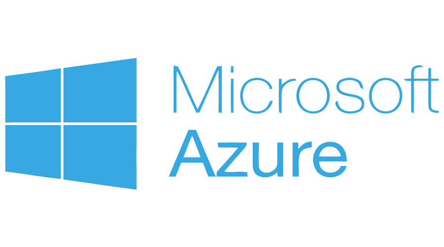

# Microsoft Azure Projects Showcase

Welcome to my Azure projects repository. Here, you'll find a collection of projects I've worked on using Microsoft Azure. Explore the various solutions, services, and applications I've developed on Azure.

  

  

## Project List
1. [**Cloud Security and Virtualization**](https://github.com/jimmyhcao/CloudSecurity)
    - A basic cloud infrastructure using virtual machines and containers
2. [**Project 1: Day 1**](https://github.com/jimmyhcao/Microsoft-Azure-Projects/blob/main/Day1.md)
    - Build, Host, and Design Your Web Application Using Azure and GoDaddy
3. [**Project 1: Day 2**](https://github.com/jimmyhcao/Microsoft-Azure-Projects/blob/main/Day2.md)
    - Secure Your Web Application with SSL Certificates
4. [**Project 1: Day 3**](https://github.com/jimmyhcao/Microsoft-Azure-Projects/blob/main/Day3.md)
    - Protect Your Web Application with Azure's Security Features
